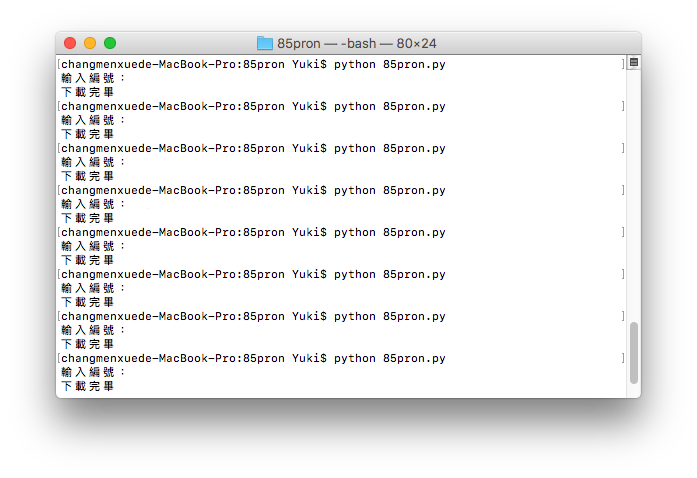

# 85pron

### 網址解析：

```
path = https://dimain/file/number

    domain = 網域名稱  
    file = 文件位置  
    number = 檔案  
```
**兩種下載方式(把註解`'''`更改即可)：**  
1. 輸入編號  
2. 輸入網址  
    
### 儲存路徑：
```
open('./' + num[0] + '.mp4', 'wb')  
    
    ./ = 當前目錄位置，欲更改儲存位置，直接換上絕對路徑
    num[0] = 檔案編號
```
**目前不考慮自行輸入檔名，因影片標題都是上傳者隨意打，所以不引用為檔案名稱。**  

***注意：並不檢查下載檔案"是否已存在"***

### 執行畫面：

