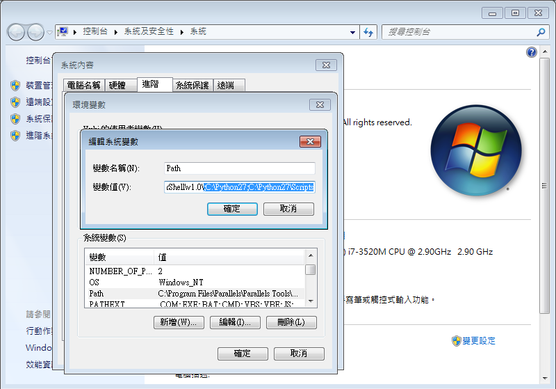

# Ecchi
廣大紳士都瞭解的詞彙，如果不屬於紳士或不理解，請務必返回即可。

## Environment
- Python 2.7
- Package
  - requests

## Table of Contents 
- [Install Python](#install-python)
- [Install package](#install-package)
- [Donate](#donate)

## Install Python

### For Windows

#### Download and Install
到官方網站下載 `python 2.7`，並安裝即可。

[official](https://www.python.org/)

#### Setting Global Variable
右鍵點選 ***我的電腦***，選擇 ***內容***、***進階系統設定***、***進階***、***環境變數***、***系統變數**，

點擊 ***Path*** 編輯，添加：
```
;C:\Python27;C:\Python27\Scripts
```


### For OS X or Linux
**預設已安裝 Python**

## Install Package

```bash
$ pip install requests
```
## Donate：

[](https://paypal.me/48763)
