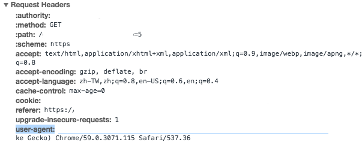

# e-hentai

### 開發歷程：

這網站是我開發到現在，覺得最奇特的一個。
    
在剛寫完這工具，很開心的要自動化下載第一本，結果才載了四張圖，程式就拋出例外！我再執行一次，這次盡然一下就拋出例外。我便打開瀏覽器看一看，才發現我...被ban了，這是人生第一次呀！所以猜想可能是秒數太短，然後等待時間又很固定，因此網站才判斷機器人行為。那我就將秒數取亂數，這樣總像人在看本了吧？結果...還是ban。
    
於是我研究網頁訪問的過程，發現起初的 `request headers` 與瀏覽器不一樣，另外對方第一包 `response headers` 會給 `cookie`，於是我就先複製瀏覽器發送的 `header`，並固定傳入 `cookie`，另外有發現 `request header` 中的 `referer` 會改變，所以我也固定每請求一次就改變。做了這些改變後，再一次測試下載，就完全正常了！

我心想，這網站做得還不錯，這些都會做偵測。但這些在我要發布程式時，一切都改觀了。我想說要把 `request hearder` 中的 `user-angent` 換成 `python` 預設的下載看看，這又讓我再次被 ban ...。可是我要發布，總不能預設帶我的 `user-angent` 吧！我就更改成 `Chrome/59.0.3071.115`，想說不會這麼簡單的做測試，結果這樣就行了...。

被玩了......

### 如何使用：  

該網站的下載器有兩個：  
**1. e-hentai.py**：  
在初始下載時所使用。

**2. continue.py**：  
當下載到一半斷線，但已經下載許多頁數時使用。

### user-agent 更改：

這邊還是建議換成瀏覽器的 `user-agent` 再使用。  
**1. More Tool**  
**2. Develpoer Tools**  
**3. 重整網頁**  
**4. 點擊任一封包，就會看到類似附圖中的畫面所反白的 `user-agent`，只要複製貼到程式內覆蓋即可！**  

### 儲存資料夾與路徑：

程式開始時，一開始就會要求輸入資料夾名稱，但是必須`不存在`的，如果存在的話，程式就會自動終止。

而資料夾會新增至程式執行的當前目錄。例如我在 `/Users/Yuki/Desktop` 執行該程式，那麼資料夾就會在該目錄底下，路徑為 `/Users/Yuki/Desktop/dir_name`。(`dir_name` 為自定義資料夾名稱)

### url 輸入：

**1. e-hentai.py**：  
因為實在不想點擊觸發多次廣告，所以只要給它吃本子總覽的 url 即可。

**2. continue.py**：  
輸入在下載中斷前一刻，所下載到的頁數 url 與頁碼

 ***注意：餵食其它 url 一定吐 exception 給你看！***
 
### 叮嚀：

程式執行失敗的話，直接把下載的資料夾整個移除，在嘗試一次。如果再一次的失敗，就先停止下載的動作，等幾分鐘再嘗試。目前有遇過網頁連線回應太久或節點失聯的問題，造成程式無法繼續。

